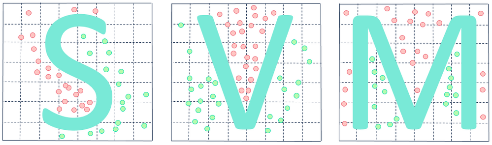

# Linear Regression from scratch

In this repository you can find SVM clissifier written in numpy from scratch with some theory explanation and methamatical background connected to this subject.
SVM offers very high accuracy compared to other classifiers such as logistic regression, and decision trees.




## Getting Started   

To run it You need jupyter notebook installed or You can run it using [google colab](https://colab.research.google.com).

The main file is [SVM.ipynb](SVM.ipynb) 

### Prerequisites
```
-numpy
-matplotlib
-sklearn
-scipy

```

## Author

* [Sohaib1424](https://github.com/Sohaib1424)
